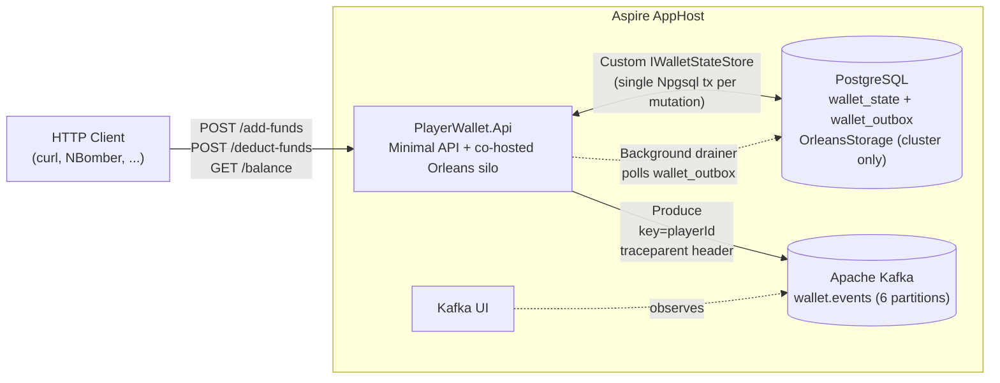
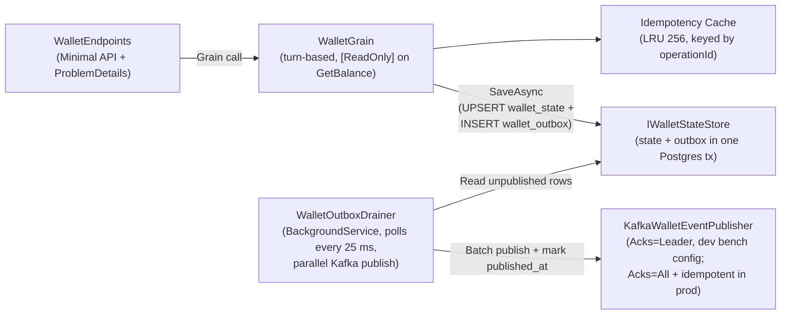

# GrainWallet

Per-player wallet microservice built on .NET Aspire, Microsoft Orleans, and Kafka.
Three HTTP operations: credit funds, debit funds, read balance. Per-grain
turn-based concurrency gives strict per-player serialization. Every mutation
commits balance + outbox event in a single PostgreSQL transaction; a
background `WalletOutboxDrainer` reads `wallet_outbox` and publishes to
Kafka off the request path.

> **Repo layout: v1 vs v2.** `main` carries v2: horizontal-scale-safe outbox
> drainer (`FOR UPDATE SKIP LOCKED`), real LRU idempotency cache, outbox
> back-pressure gate (HTTP 503), endpoint pre-grain validation,
> `synchronous_commit=on` by default, currency column tightened to
> `VARCHAR(3)` with a CHECK constraint, and a breaking event rename
> (`DeductionRejected` -> `OperationRejected`). The full v1 codebase is
> preserved on the [`v1`](https://github.com/w1ck3ds0d4/GrainWallet/tree/v1)
> branch; v1's `ENGINEERING_JOURNAL.md` is kept verbatim as a historical
> record. Full v1 -> v2 delta: [`CHANGELOG_V2.md`](CHANGELOG_V2.md).

> **v1-vs-v2 comparison dashboard.** A standalone ASP.NET Core app at
> [`src/PlayerWallet.Dashboard`](src/PlayerWallet.Dashboard) gives you a
> single web UI that runs NBomber against v1 and v2 in parallel and
> renders the latency results side by side. See
> [Comparison dashboard](#comparison-dashboard-v1-vs-v2) below for setup.

## Architecture



Inside the API host:



Why this shape: `ENGINEERING_JOURNAL.md` §7 walks through three
measured architectures and the bench math behind picking the
single-transaction custom store.

## Prerequisites

- .NET 10 SDK
- Docker Desktop running (or any other Aspire-compatible container runtime)
- `gh` CLI optional (used to drive CI and merge PRs)

## Run the whole stack

```bash
dotnet run --project src/PlayerWallet.AppHost
```

The Aspire dashboard auto-opens. It surfaces:

- The wallet API logs and metrics (live OTel)
- The PostgreSQL container status and connection string
- The Kafka broker and `wallet.events` topic
- The Kafka UI sidecar at its own dashboard URL
- The Scalar API explorer at `/scalar/v1`

Press `Ctrl+C` to stop everything. Postgres uses
`ContainerLifetime.Persistent` so the seeded wallet data survives
restarts; Kafka is recreated each run on a pinned host port so
`KAFKA_ADVERTISED_LISTENERS` and the Docker host binding stay in
sync.

### Port configuration

The AppHost pins two host ports for repeatable demo URLs:

| Resource | Default | Override |
|---|---|---|
| API HTTP | `5000` | `WALLET_API_HOST_PORT` |
| Kafka broker | `19092` | `WALLET_KAFKA_HOST_PORT` |

Postgres and the Kafka UI keep Aspire's randomly-allocated host
ports; their addresses are surfaced as clickable URLs on the Aspire
dashboard. If something already binds to `5000` or `19092` on your
dev box, set the override env var before `dotnet run`. The load
harness defaults to `http://localhost:5000`; set `WALLET_API_URL`
if you override the API port.

### Without Aspire (single-process mode)

The API also runs standalone with memory grain storage,
`InMemoryWalletStateStore`, and a no-op event publisher (no Postgres
or Kafka required). This is the path the component tests exercise:

```bash
dotnet run --project src/PlayerWallet.Api
```

Default URL is `http://localhost:5036` (from
`src/PlayerWallet.Api/Properties/launchSettings.json`).

## Try the endpoints

Open `requests/wallet.http` in VS Code (built-in REST client; no extension
required) and run the named requests inline. `requests/scenarios.http` walks
the full demo sequence (happy path -> idempotency -> insufficient funds ->
currency mismatch -> invalid amount).

Quick curl:

```bash
curl -X POST http://localhost:5000/wallets/p1/add-funds \
     -H "Content-Type: application/json" \
     -d '{"operationId":"00000000-0000-0000-0000-000000000001","amount":{"amount":100,"currency":"EUR"}}'

curl http://localhost:5000/wallets/p1/balance
```

OpenAPI document at `http://localhost:5000/openapi/v1.json` (Development only).
Interactive API explorer (Scalar) at `http://localhost:5000/scalar/v1`
(Development only). Both surface as clickable URLs on the `api` resource in
the Aspire dashboard. Liveness at `/health/live`, readiness at `/health/ready`.

## Tests

| Project                              | Scope                                                                                |
|--------------------------------------|--------------------------------------------------------------------------------------|
| `tests/PlayerWallet.Tests.Component` | xUnit. Money value object, WalletGrain unit tests, concurrent race tests, HTTP component tests via `WebApplicationFactory`, Kafka trace-context propagation tests, end-to-end outbox pipeline integration test (Testcontainers Postgres + Kafka). 63 unit/component tests pass locally; the outbox pipeline test is `Trait("Category", "Integration")` so it can be filtered out when Docker is not running and runs on CI. |
| `tests/PlayerWallet.Tests.Load`      | NBomber console. 1000 rps x 5 min per endpoint. Pre-warms every grain via GET /balance before measurement so the first window does not show grain-activation tail. The hot-wallet appendix is wired up but skipped on the Windows submission run as a TCP ephemeral-port artifact (see `ENGINEERING_JOURNAL.md`, hot-wallet appendix). |

### Run the unit + component test suite

```bash
dotnet test PlayerWallet.slnx -c Release
```

The headline correctness proofs live in
`tests/PlayerWallet.Tests.Component/Grain/WalletGrainConcurrencyTests.cs`:

- 100 parallel deductions settle to an exact final balance with monotonically
  decreasing `BalanceAfter` across the 100 published events
- 100 parallel deductions beyond balance produce exactly 50 successes plus
  50 `InsufficientFunds` rejections, final balance 0 (no double-spend)
- 25 parallel duplicate operationIds apply exactly once with a single
  `FundsDeducted` event emitted

### Run the load benchmarks

```bash
# AppHost must already be running in another terminal
dotnet run -c Release --project tests/PlayerWallet.Tests.Load
```

Each scenario writes an HTML + CSV + Markdown + .txt report to
`tests/PlayerWallet.Tests.Load/reports/<scenario>/`. The submission
reports from the spec-compliant 5-minute run are committed so a
reviewer can open the HTMLs directly without re-running the bench.
Run a single scenario by passing its name as the first positional
arg:

```bash
dotnet run -c Release --project tests/PlayerWallet.Tests.Load -- add-funds
dotnet run -c Release --project tests/PlayerWallet.Tests.Load -- deduct-funds
dotnet run -c Release --project tests/PlayerWallet.Tests.Load -- get-balance
dotnet run -c Release --project tests/PlayerWallet.Tests.Load -- hot-wallet
```

Override the target URL via `WALLET_API_URL` env var or pass it
positionally as `http://localhost:5000`. Override target RPS / warmup
/ measurement window via `WALLET_TARGET_RPS`, `WALLET_WARMUP_SECONDS`,
and `WALLET_MEASURE_SECONDS` for perf-debugging sweeps.

## Comparison dashboard (v1 vs v2)

Standalone ASP.NET Core web app under
[`src/PlayerWallet.Dashboard`](src/PlayerWallet.Dashboard). It does NOT
import either PlayerWallet codebase, it just makes HTTP calls. Boot both
the v1 and v2 stacks on different host ports, then start the dashboard
and click "Run benchmark" to see latency side by side.

### Boot v1 + v2 on side-by-side ports

v1 lives on the `v1` branch of this repo. The simplest layout is a sibling
git worktree:

```powershell
cd C:\Users\danie\Documents\GitHub\repos\GrainWallet
git worktree add ..\GrainWallet-v1 v1
```

Terminal A (v1):

```powershell
cd C:\Users\danie\Documents\GitHub\repos\GrainWallet-v1
dotnet run --project src/PlayerWallet.AppHost
```

Terminal B (v2 on alternate ports):

```powershell
cd C:\Users\danie\Documents\GitHub\repos\GrainWallet
$env:WALLET_API_HOST_PORT = "5001"
$env:WALLET_KAFKA_HOST_PORT = "19093"
dotnet run --project src/PlayerWallet.AppHost
```

Terminal C (dashboard):

```powershell
cd C:\Users\danie\Documents\GitHub\repos\GrainWallet
dotnet run --project src/PlayerWallet.Dashboard
```

Open [http://localhost:5100](http://localhost:5100) in a browser.

### What the dashboard does

- **Health cards.** Polls `/health/ready` on both APIs every 5 seconds and
  shows up/down badges.
- **Run benchmark button.** Pick a scenario (`get-balance`, `add-funds`,
  `deduct-funds`) and which projects to target. The dashboard registers
  both NBomber scenarios in the same runner and lets them race in
  parallel, then renders mean / p50 / p95 / p99 / stddev / RPS per
  project in side-by-side cards.
- **History.** Last 20 runs in memory; click any row to re-render its
  result cards.

### Bench knobs

Defaults (deliberately short so the button feels interactive):

| Knob | Default | Override in `appsettings.json` |
|---|---|---|
| Warmup | 5 s | `Dashboard:Bench:WarmUpSeconds` |
| Measurement | 30 s | `Dashboard:Bench:DurationSeconds` |
| Target rps per project | 200 | `Dashboard:Bench:RequestsPerSecond` |
| Wallet pool size | 100 | `Dashboard:Bench:WalletPoolSize` |

For the full 5-minute @ 1000 rps production-grade bench, keep using
`tests/PlayerWallet.Tests.Load` instead. The dashboard is for
interactive comparison, not formal benchmarking.

### Notes

- The dashboard runs NBomber in-process. One run at a time across all
  projects; subsequent run requests return `409 Conflict` until the
  current run finishes.
- Reports land in `src/PlayerWallet.Dashboard/bin/.../reports/`. The
  dashboard renders results from the in-memory `NodeStats` so you
  don't need to open them.
- It's reachable from anywhere on `localhost`; you can also share it
  on the local network by binding `0.0.0.0:5100`
  (`ASPNETCORE_URLS=http://0.0.0.0:5100`).

## Project layout

```
src/
  PlayerWallet.AppHost/         Aspire orchestrator (Postgres + Kafka + Kafka UI + API)
  PlayerWallet.ServiceDefaults/ OTel pipeline, health checks, service discovery
  PlayerWallet.Contracts/       Money value object, IWalletGrain, request/response DTOs, event records
  PlayerWallet.Grains/          WalletGrain, WalletState, IWalletEventPublisher, IWalletStateStore,
                                InMemoryWalletStateStore, WalletStateJsonContext, OTel meters
  PlayerWallet.Api/             Minimal API + co-hosted silo, Kafka publisher (Kafka/),
                                PostgresWalletStateStore + WalletOutboxDrainer + schema bootstrap (Db/)
  PlayerWallet.Dashboard/       Standalone web app: side-by-side v1/v2 health + on-demand NBomber bench
tests/
  PlayerWallet.Tests.Component/ xUnit: Money, grain, HTTP, Kafka propagation, end-to-end outbox
                                pipeline test (Outbox/ - uses Testcontainers Postgres + Kafka)
  PlayerWallet.Tests.Load/      NBomber console
requests/                       VS Code REST client request files
.vscode/                        launch.json (F5 to run AppHost) + tasks.json (Ctrl+Shift+B for CI gates)
.github/workflows/ci.yml        format + build (-warnaserror) + test on push and PR
```

## Local CI gates

VS Code: `Ctrl+Shift+B` -> select `gates`. Or from the command line:

```bash
dotnet format PlayerWallet.slnx --verify-no-changes --severity error
dotnet build  PlayerWallet.slnx -c Release -warnaserror
dotnet test   PlayerWallet.slnx -c Release --no-build
```

These three gates also run on every push and PR via `.github/workflows/ci.yml`.

## Documents

- `ENGINEERING_JOURNAL.md` documents the AI-assisted approach, prompts, decisions, failure-recovery semantics, security gaps, and known weaknesses.
- `DEMO.md` is a step-by-step walkthrough for a live review of this codebase.
